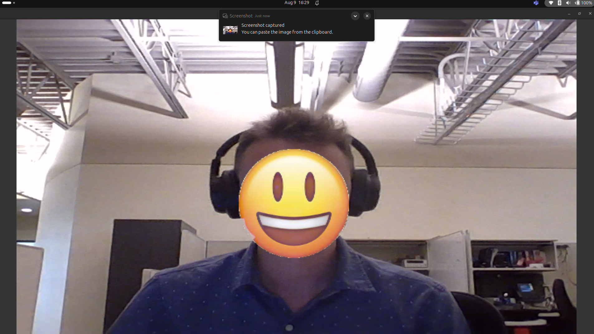
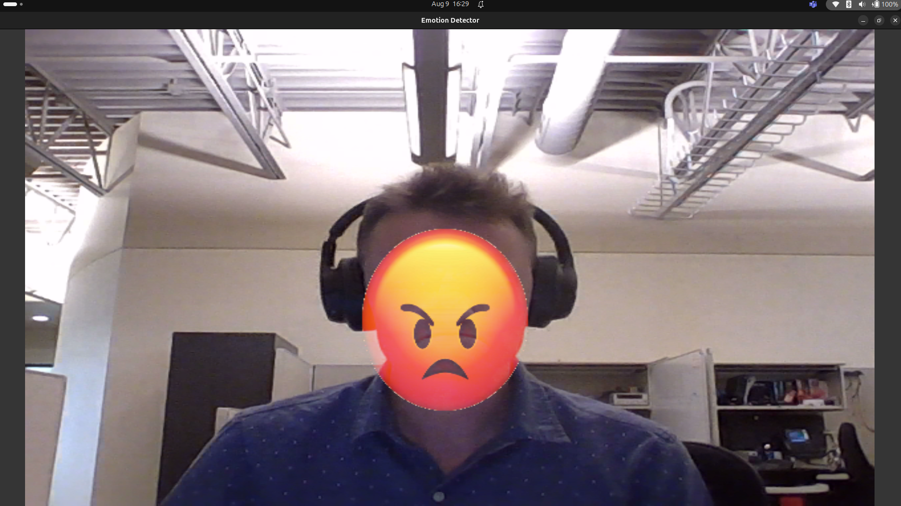
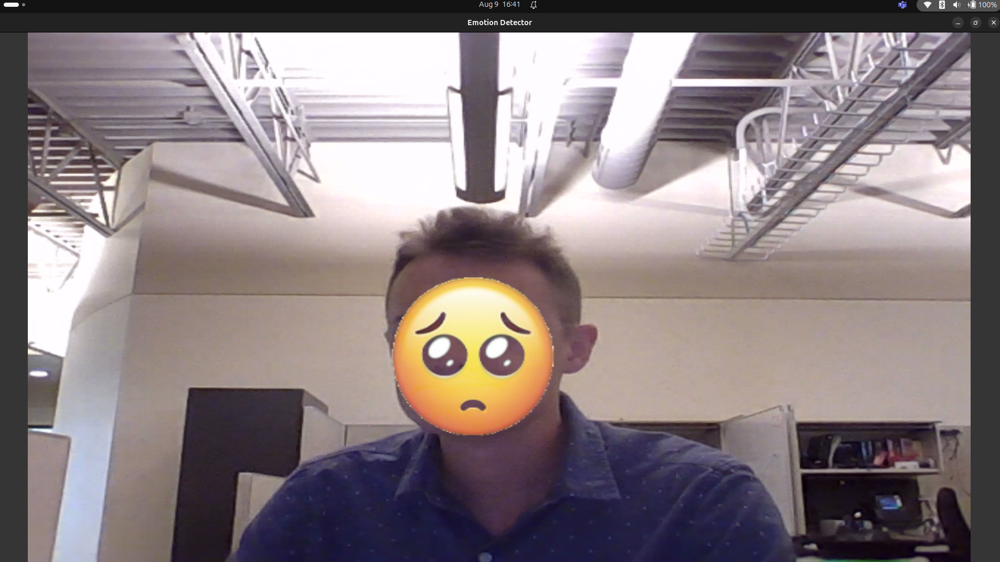
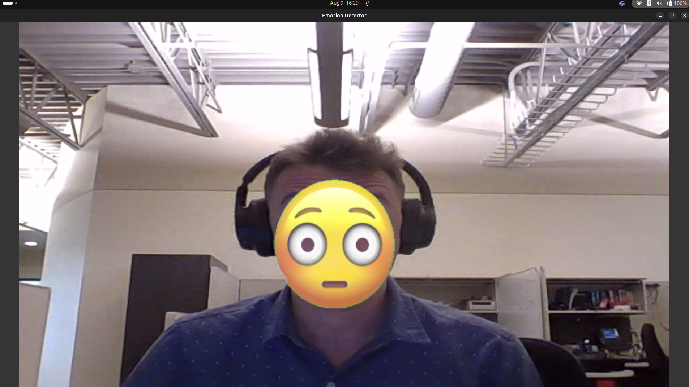
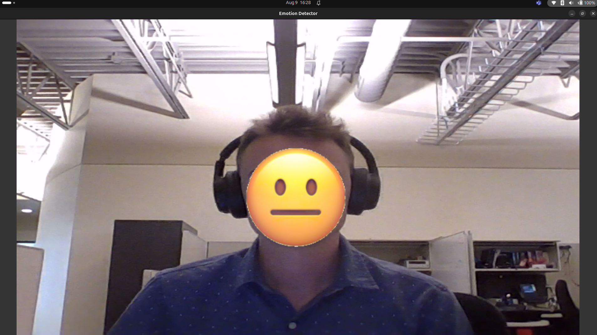
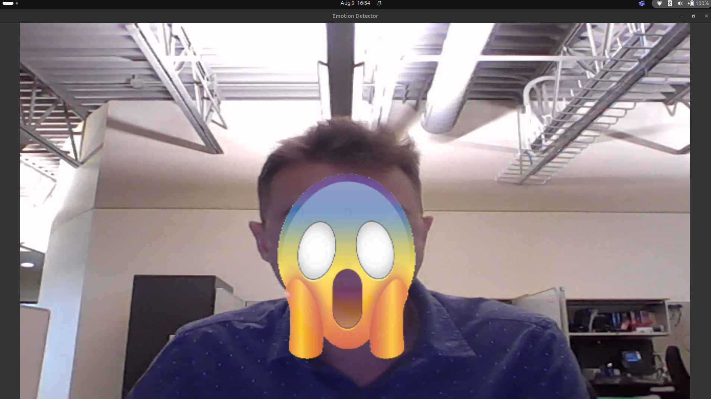

# Real Time Multiple Face Emotion Detection

| | | |
|:---------------------:|:-------------------:|:-----------------:|
| |  | |
|  |  |  |
| | | |

## Overview

This program uses [YuNet](https://github.com/opencv/opencv_zoo/tree/main/models/face_detection_yunet) for face detection, and then runs all detected faces through [this](https://github.com/martycheung/CppND-Facial-Emotion-Recognition/blob/master/model/Facial_Emotion_Recognition_Model_CNN.ipynb) model for emotion detection. The models output is mapped to an emoji, which is then overlayed on each persons face.

Emotions are refreshed every 0.5 seconds with the default program, but this is configureable. Faces are tracked based on their horizontal position, so if two people were to swap positions before the refresh time, their emotions will switch. A refresh rate of 0.5 seconds is long enough to keep the emotion predictions smooth, but not too long so that the emotion swapping problem is not noticeable.

## Getting Started

1. `git clone https://github.com/Jensen-holm/emotion-detector` <br>
2. `cd emotion-detector` <br>
3. `pip install -r requirements.txt` <br>
4. `python3 main.py`

If you want to use something other than your default opencv camera (cv2.VideoCapture(0)), or change the emotion refresh rate, change this line at the bottom of `main.py`: <br>

```python
if __name__ == "__main__":
    main(cam_idx=0, refresh_interval=0.5)
```
